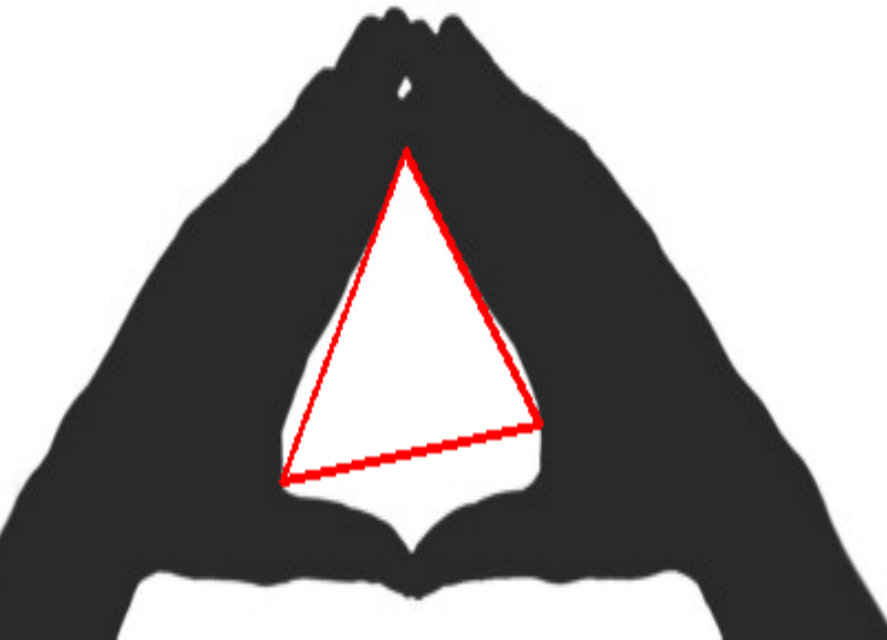

# OpenCV_iOS_triangleDetection

# What is my main goal ?

I have to detect when a triangle is drawn by hands.

I must be careful with the environment so that I won't be disturbed by the light or other things in the background.

## How do I import openCV iOS ?

### Link Libraries
Go to Project > Build Phases > Link Binary With Libraries
* AssetsLibrary.framework
* CoreGraphics framework
* Foundation.framework
* UIKit.framework

### Import openCV 2
Drag and drop opencv2.framework in the directory frameworks :
* check Copy the items
* check create groups 
* check add to targets "project"
* in ViewController.h add the line : #import <opencv2/opencv.hpp>
* don't forget to rename ViewController.m in ViewController.mm

### Versions

OS X : El Capitan 10.11.4

XCode : 7.3

OpenCV 3.1.0 
